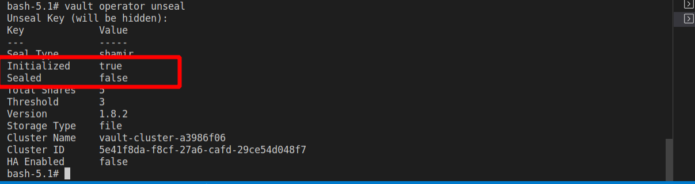

# api-template-v3
> A template for creating and deploying flask APIs.

## Introduction

The API itself is a simple flask application that enables an admnistrator to register. Upon logging in, they are issued with an access token that allows them to create a new user. You can read more about it, including how it was developed over at [How to Deploy a Production Grade Flask application to an AWS EC2 Instance using GitHub Actions.](https://medium.com/@lyle-okoth/how-to-deploy-a-production-grade-flask-application-to-an-aws-ec2-instance-using-github-actions-6241886b197).

## Application routes

This interaction with the application happens overthe following routes:

| Route       | Method      | Description      |
| ----------- | ----------- |----------------- |
| '/'         | GET         | Get the home page |
| '/user'     | GET         | Get a single user by supplying an ID |
| '/user'     | POST        | Create a new user by supplying the email address |
| '/user'     | PUT         | Update a single user's data by supplying the user ID and email address |
| '/user'     | DELETE      | Delete a single user by supplying the users ID |
| '/users'    | GET         | Get the list of all created users |
| '/auth/register'     | POST         | Register a new admin. |
| '/auth/login'     | POST         | Login a registered admin to get an access token. |
| '/auth/me'     | GET         | Get a logged in admins data. |
| '/auth/me'     | PUT         | Update a logged in admins data. |
| '/auth/me'     | DELETE      | Delete a logged in admins data. |
| '/auth/admins'     | GET         | Get all logged in admins data. |

## Application Features

The application has the following features:

- Secret management with Hashicorp's Vault.
- Logging with AWS Firehose and AWS Open Search
- Authorizaton using Json Web Tokens
- Database Management using PostgreSQL
- Email sending using Amazon SES
- Documentation with mkdocs and swagger
- GitHub Actions to run tests and code quality checks

## Application Development Workflow

During the development, atleast five branches were used:
- Features branch used when developing new features. This is then merged into the development branch, only if all the steps present in the feature development workflow pass.
- Development branch that hosts the development code. All the features that are actively being built are found in this branch. It is later merged into the staging branch, only if all the steps specified in the development workflow pass.
- Staging branch that holds the code that is to be merged into production.
- Release branch that holds all the items and artifacts that are used when creating a new release.
- Production branch that holds the code that is currently deployed.

## Application setup

### Vault Setup

To test out the application, first check out the code frm the development branch

```sh
git clone https://github.com/twyle/api-template-v4.git
```

#### Navigate into the cloned repo

```sh
cd api-template-v4
```

#### Start the Vault server

```sh
make start-vault
```

#### Get a bash shell on the running vault container

```sh
make vault-bash
```

#### Initialize Vault

Within the bash session

```sh
vault operator init
```

This gives you the 5 unseal keys and the root token. Store these safely.


#### Unseal vault

Within the bash session, run this command three times, ech time supplying a different unseal key.

```sh
vault operator unseal
```



#### Log into Vault

Within the bash session

```sh
vault login
```

### Secret Creation

After initializing and unsealing vault, you can now create secrets. To create key value pairs, you will need to enable the kv engine

#### Enable the kv engine

At the bash session:

```sh
vault secrets enable kv
```

#### Write a secret at the bash session

For the application to work, we need the following secrest:

- FLASK_APP=api/__init__.py
- FLASK_ENV=development
- SECRET_KEY=supersecretkey
- POSTGRES_HOST=<YOUR-IP-ADDRESS>
- POSTGRES_DB=lyle
- POSTGRES_PORT=5434
- POSTGRES_USER=postgres
- POSTGRES_PASSWORD=lyle
- MAIL_HOST=<YOUR-MAIL-HOST>
- MAIL_PORT=<YOUR-MAIL-PORT>
- MAIL_USERNAME=<YOUR-USER-NAME>
- MAIL_PASSWORD=<YOUR-PASSWORD>
- FIREHOSE_DELIVERY_STREAM=flask-logging-firehose-stream

To create these secrets, the format used is:

 ```sh
 vault kv put kv/<project-name>/<environment>/<secret_name> SECRET_NAME=value i.e
 vault kv put kv/api-template-v4/local/flask_environment FLASK_ENV=development
 ```

Follow that format for all the secrets.

```sh
vault kv put kv/api-template-v4/local/flask_environment FLASK_ENV=development
vault kv put kv/api-template-v4/local/flask_app FLASK_APP=api/__init__.py
```

### Database Setup

#### Start the database container

To set up the PostgreSQL Database, on a different terminal

```sh
make start-db-containers
```

#### Create the database tables

```sh
make create-db
```

#### Insert a couple of records
```sh
make seed-db
```

### Start the application

Finally, start the application

```sh
make run
```
## Application Use

Then navigate to http://localhost:5000/apidocs, you will get


